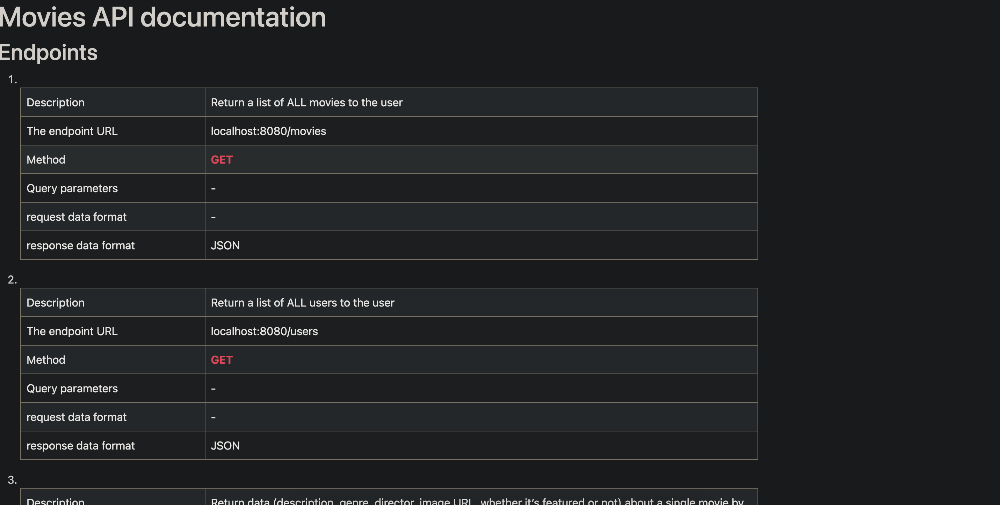

# CareerFoundry - Server-Side Programming & Node.js

This is a combined solution for the third achievement in fullstack Server-Side Programming & Node.js.

## Table of contents

- [Overview](#overview)
  - [The challenge](#the-challenge)
  - [Screenshot](#screenshot)

- [My process](#my-process)
  - [Built with](#built-with)
  - [What I learned](#what-i-learned)
  - [Continued development](#continued-development)
  - [Useful resources](#useful-resources)

## Overview

### The challenge

Users should be able to:

- See hover states for interactive elements

### Screenshot



## My process

### Built with
<!-- [](https://skillicons.dev) -->
<p align="center">
  <a href="https://skillicons.dev">
    
  </a>
</p>

### What I learned

Use this section to recap over some of your major learnings while working through this project. Writing these out and providing code samples of areas you want to highlight is a great way to reinforce your own knowledge.

To see how you can add code snippets, see below:

#### Mongo installation on Ubuntu 22.04 Jammy

there was now direct installation method for lts 22.04, installation script was found on [Mongodb forum](https://www.mongodb.com/community/forums/t/installing-mongodb-over-ubuntu-22-04/159931/89)

```bash
wget -qO - https://www.mongodb.org/static/pgp/server-6.0.asc |  gpg --dearmor | sudo tee /usr/share/keyrings/mongodb.gpg > /dev/null

echo "deb [ arch=amd64,arm64 signed-by=/usr/share/keyrings/mongodb.gpg ] https://repo.mongodb.org/apt/ubuntu jammy/mongodb-org/6.0 multiverse" | sudo tee /etc/apt/sources.list.d/mongodb-org-6.0.list

sudo apt update
sudo apt install mongodb-org
```

```css
.proud-of-this-css {
  color: papayawhip;
}
```

```js
const proudOfThisFunc = () => {
  console.log('🎉')
}
```

If you want more help with writing markdown, we'd recommend checking out [The Markdown Guide](https://www.markdownguide.org/) to learn more.

**Note: Delete this note and the content within this section and replace with your own learnings.**

### Continued development

Use this section to outline areas that you want to continue focusing on in future projects. These could be concepts you're still not completely comfortable with or techniques you found useful that you want to refine and perfect.

**Note: Delete this note and the content within this section and replace with your own plans for continued development.**

### Useful resources

- [Example resource 1](https://www.example.com) - This helped me for XYZ reason. I really liked this pattern and will use it going forward.
- [Example resource 2](https://www.example.com) - This is an amazing article which helped me finally understand XYZ. I'd recommend it to anyone still learning this concept.
